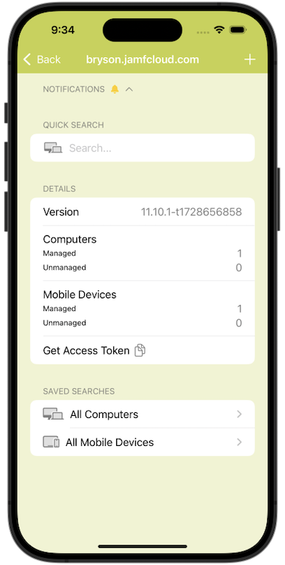
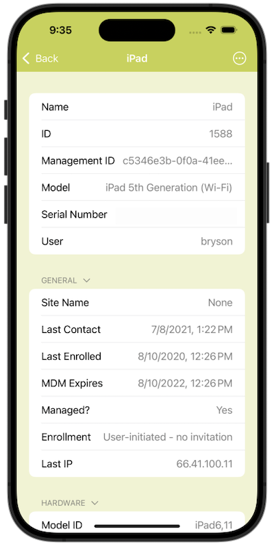

# Jasper

A companion app for Jamf Pro operators and administrators.

Jasper is one of several starter apps I worked on to learn different skills with Swift. The focus of Jasper is building interfaces around APIs using the [`swift-openapi-generator`](https://github.com/apple/swift-openapi-generator). This is also an attempt at a cross-platform app that displays optimally for either iPhone or iPad.

The code for this app is being made available for anyone to reference, copy, critique, or take inspiration from.

## Multiple Jamf Pro Servers

Connect to more than one Jamf Pro instance and color code the intrerface so you always know which one you are working with at a glance.

## Jamf Pro Views

Basic server information and alerts are visible on the main view. You can perform a quick search entering text that will be matched against a wide range of proprities such as serial numbers, device names, models, and assigned username.

On iPad these results will be requested and loaded as you type.

## Saved Searches

Constantly used searches can be saved for single tap loading. All the search features of this app wrap around the `/v1/computers-inventory` API and its available filters.

